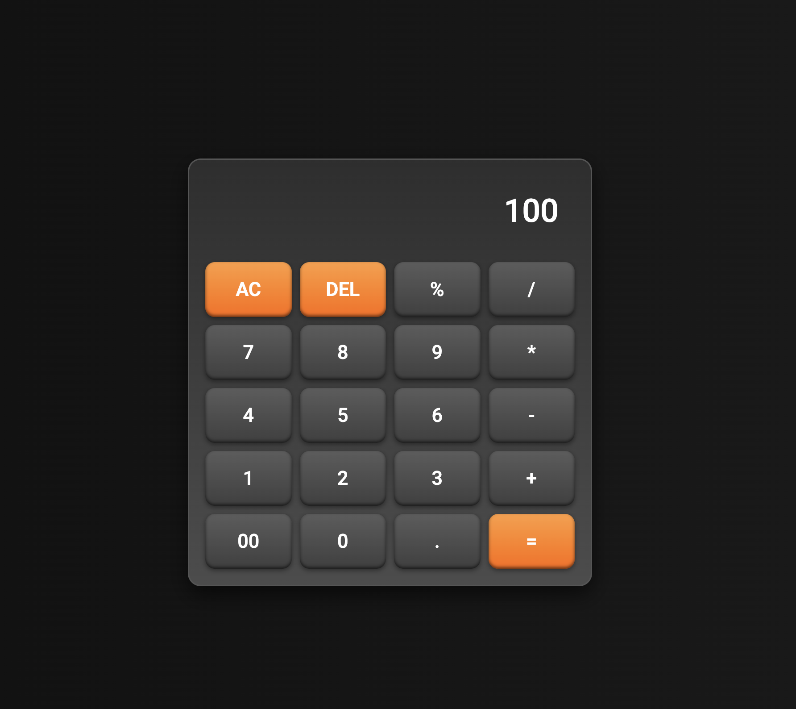

# Calculator 🧮

**Calculator** built using **HTML**, **CSS**, and **JavaScript**.

## About this project 🚀

This calculator allows users to perform basic arithmetic operations such as addition, subtraction, multiplication, and division. It takes user input through button clicks, processes the logic using JavaScript, and dynamically updates the display with the calculated result.

This project helped me improve my understanding of JavaScript logic, functions, and how to build interactive UI components.

### Technologies 🛠️

- `HTML`
- `CSS`
- `JavaScript`

### 🎥 Demo / 🖼️ Screenshot

## Note

- Built for desktop — responsiveness not included.

### Live Demo: https://areebamoosa.github.io/Calculator/
